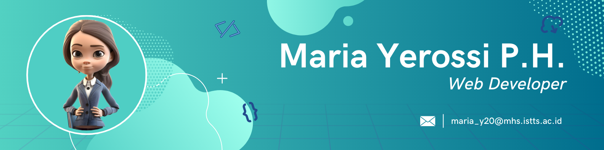

# Hi there 👋 , I'm Maria Yerossi!

Hello👋, I am a Business Information System student at institut Sains dan Teknologi Terpadu Surabaya (iSTTS) and specializing in full stack development👩‍💻. Experienced with all stages of the development cycle for dynamic web projects. Well-versed in numerous programming languages including PHP, JavaScript, Java, C#, Python, Kotlin, SQL. Familiarity with programming frameworks such as Laravel and Codeigniter. I have a strong background in project management.
